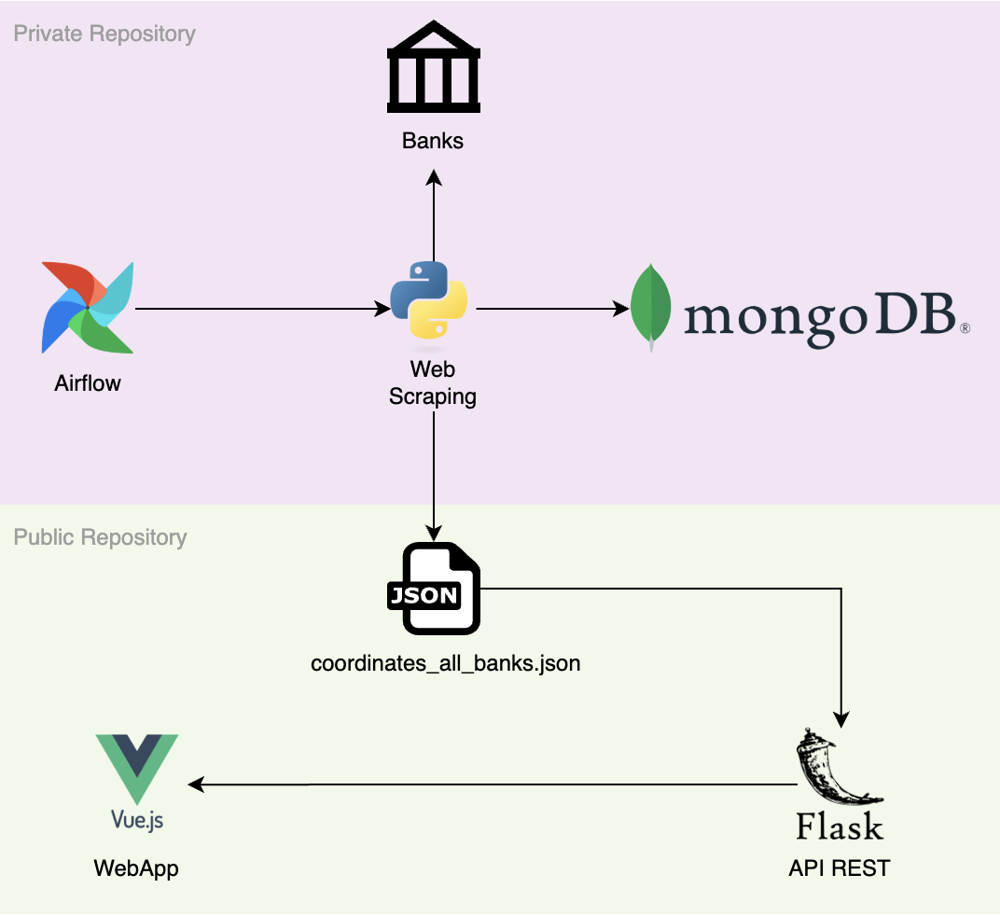

# Mapa interactivo de descuentos en restaurantes con tarjetas de crédito en Chile 🇨🇱

Esta app muestra en un mapa interactivo los descuentos en restaurantes que ofrecen los bancos en Chile al pagar con sus respectivas tarjetas.

La app georeferencia restaurantes disponibles a partir de tu ubicación actual. 

Listado de bancos disponibles en el mapa:
- Banco Scotiabank
- Banco Itaú

Este proyecto utiliza Beautiful Soup y Selenium para el WebScraping. Por motivos de privacidad, el código fuente de este workflow es privado. Los datos extraídos se almacenan en MongoDB, pero para este repositorio público se proporciona un archivo JSON con la información recolectada. A continuación se muestra el diagrama de la solución:



## Estructura del Proyecto

El proyecto consta de dos partes principales ya preconstruidas:

- `frontend`: Una aplicación Vue.js que muestra los descuentos en un mapa interactivo.
- `backend`: Una API Flask que proporciona los datos de los descuentos.

## Cómo ejecutar el proyecto

Para ejecutar el proyecto, necesitarás tener docker y docker-compose instalados en tu máquina.

1. Clona el repositorio:
```bash
git clone https://github.com/gcuriqueo/map-descuentos-chile.git
cd map-descuentos-chile
```

2. Construye las imágenes y levanta los contenedores:
```bash
docker-compose up
```

Una vez iniciado los servicios, podrás acceder a la aplicación Vue.js en localhost:8080 y a la API Flask en localhost:8100.


